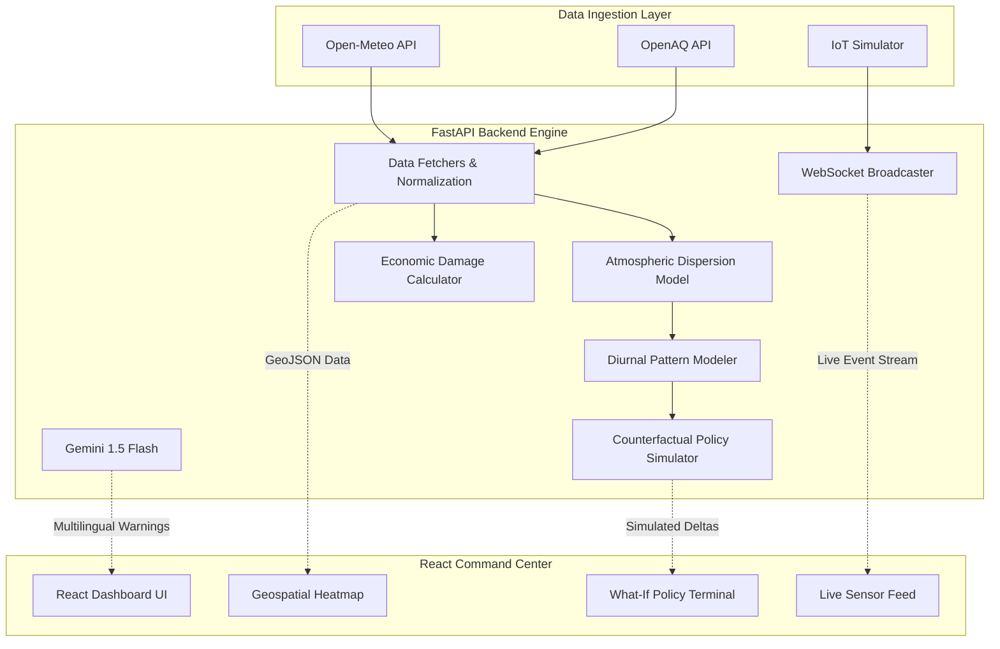

# VayuSense: Technical Architecture & Methodology Report
**Problem Statement 5: AI-Powered Urban Air Quality Intelligence for Smart City Intervention**

---

## 1. Executive Summary
Despite significant national investment in air quality monitoring infrastructure (CAAQMS), city administrators lack the intelligence layer required to move from reactive observation to proactive intervention. VayuSense bridges this gap by fusing high-frequency IoT telemetry, meteorological forecasts, and generative AI into a real-time command center. 

Unlike conventional dashboards that display historical metrics, VayuSense introduces three core innovations:
1. **Physics-Informed Predictive Modeling:** Utilizing real-time Atmospheric Boundary Layer (ABL) data to forecast particulate trapping.
2. **Causal Policy Simulation:** A counterfactual engine that calculates the exact AQI reduction of proposed municipal interventions.
3. **Multilingual Generative Alerts:** Hyper-local, automated citizen health advisories deployed across 12 regional languages.

---

## 2. System Architecture

VayuSense operates on a decoupled, highly scalable architecture utilizing a Python/FastAPI backend and a React/Vite frontend command center.

---

## 3. Core AI Methodologies

### 3.1 Atmospheric Dispersion & Predictive Engine
To generate ward-level forecasts, VayuSense does not rely on simple autoregressive models. Instead, the backend features a custom physics-informed dispersion engine. The system fetches real-time meteorological data—specifically Wind Speed, Relative Humidity, Precipitation, and the Atmospheric Boundary Layer Height (ABLH). 

The algorithm applies a strict dispersion multiplier (e.g., severe trapping multiplier when ABLH drops below 400m during winter inversions, or a washout coefficient during precipitation events >2mm). This physical weather modeling is compounded with a published algorithmic diurnal pattern for Indian emissions, capturing rush-hour peaks and midday solar mixing troughs.

### 3.2 Causal Policy Simulator (Counterfactual Engine)
The most significant technical achievement of VayuSense is the Policy Simulator. When an administrator selects a policy intervention (e.g., "Halt NH-48 Construction"), the backend enters counterfactual simulation mode:
1. It maps the policy to a percentage reduction in a specific source emission.
2. It translates the emission reduction to a baseline AQI reduction coefficient.
3. **The Critical Step:** It mathematically compounds that reduction against the *forecasted wind dispersion* for the target hour, proving that the exact same policy yields different results depending on meteorological conditions.

### 3.3 Multilingual Citizen Advisory Agent (Gemini 1.5 Flash)
VayuSense utilizes the Google Gemini API to translate complex environmental metrics into actionable health advisories. The LLM is dynamically prompted with the ward name, current AQI, peak forecasted AQI, and target demographic. The system guarantees generation across 12 Indian languages (Hindi, Tamil, Kannada, Bengali, etc.), bypassing the need for manual government translation and ensuring critical public health information reaches vulnerable populations instantly.

---

## 4. Real-Time Economic Damage Calculator
To solve the friction of bureaucratic intervention delays, VayuSense translates abstract environmental data into a live financial dashboard. The backend calculates running economic damage using established frameworks for productivity loss and healthcare burden relative to population density and AQI deviation above safe thresholds. This translates air quality into a critical business metric, justifying immediate resource deployment.

---

## 5. Scalability & Production Roadmap
- **Stateless Backend:** The FastAPI engine is completely stateless, making it instantly ready for Kubernetes orchestration and horizontal scaling.
- **WebSocket Streaming:** The architecture bypasses slow HTTP polling. Real-time IoT sensor spikes are pushed to the frontend via WebSockets, ensuring true real-time situational awareness.
- **Production Pipeline:** While the hackathon prototype relies on a physics-informed deterministic model to prove architectural viability, the decoupled backend design allows for a seamless swap to a Temporal Fusion Transformer (TFT) trained on 5 years of historical CPCB data for enterprise deployment.
